---
title: Manifestations ornementales contemporaines
...

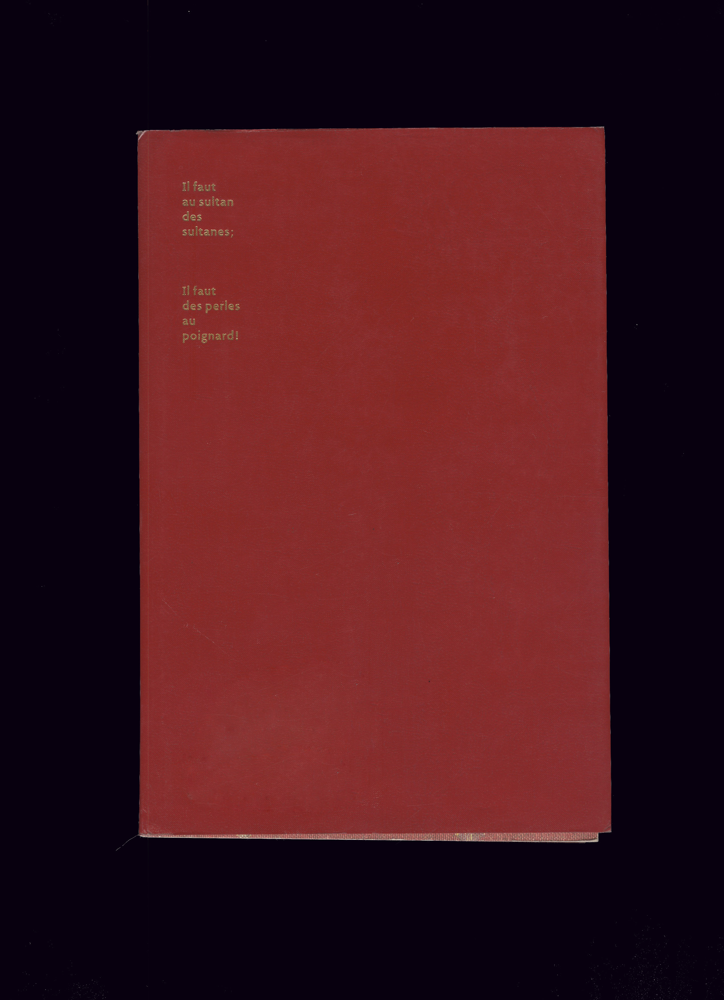

	
«Il faut au sultan des sultanes; Il faut des perles au poignard!»<a href="#note1" id="retour1">1</a> Cette inscription se lit sur la couverture du ☜ catalogue d’exposition *Les Orientales*, présentée à la Maison de Victor Hugo. Ce catalogue a été édité par Paris-Musées en 2010 et dessiné par SpMillot. Le livre se présente à moi par sa couverture simple. Lettres dorées sur simili cuir bordeaux. C’est une sur-couverture et, dessous, est imprimé un motif provenant certainement d’un tapis dont on aperçoit les fibres. Dans son intérieur le livre renferme différents papiers, allant du finement doré au glacé. Il est riche en formes et en contenus, ☟ les poèmes de Victor Hugo courent tout au long de l’ouvrage sur des papiers plus fins encore que ceux utilisés pour rouler les cigarettes. Les œuvres sont imprimées sur des pages au papier couché légendées gracieusement. ☟ La présentation, en entrée du catalogue, est imprimée sur un papier taupe plus épais et, dans un encart vert rappelant les gravures orientales, le texte de l’ancien maire de Paris, Bertrand Delanoë, se déploie petit à petit. Les cahiers sont reliés au fil doré. De ce livre se dégage alors, lorsqu’on le prend en main, une manifestation d’équilibre. De son poids à sa mise en forme, tout semble se déplier naturellement et ses qualités ne résident pourtant pas dans sa simplicité. J’y retrouve ce lieu commun du livre, dans son format connu pouvant être celui d’un roman, son épaisseur ou encore sa prise en main. Un archétype livresque. Une expression classique mais dans une forme, qui tout de même implique le contemporain. Dans son ensemble, il se veut alors orné mais non décoratif et c’est ici pour la première fois que cette distinction m’apparaît. Une première clarification que je découvre: le décoratif, se reporte à la mise en scène, il englobe, il habille, et l’orné est décoration. Il se rapporte à l’objet, en est inséparable comme gravé dans l’identité même de celui-ci. Il est dans sa définition. Ainsi, les papiers différents, les détails de reliure, je les considèrent comme *ornements*, entrant dans la définition de l’ouvrage. 

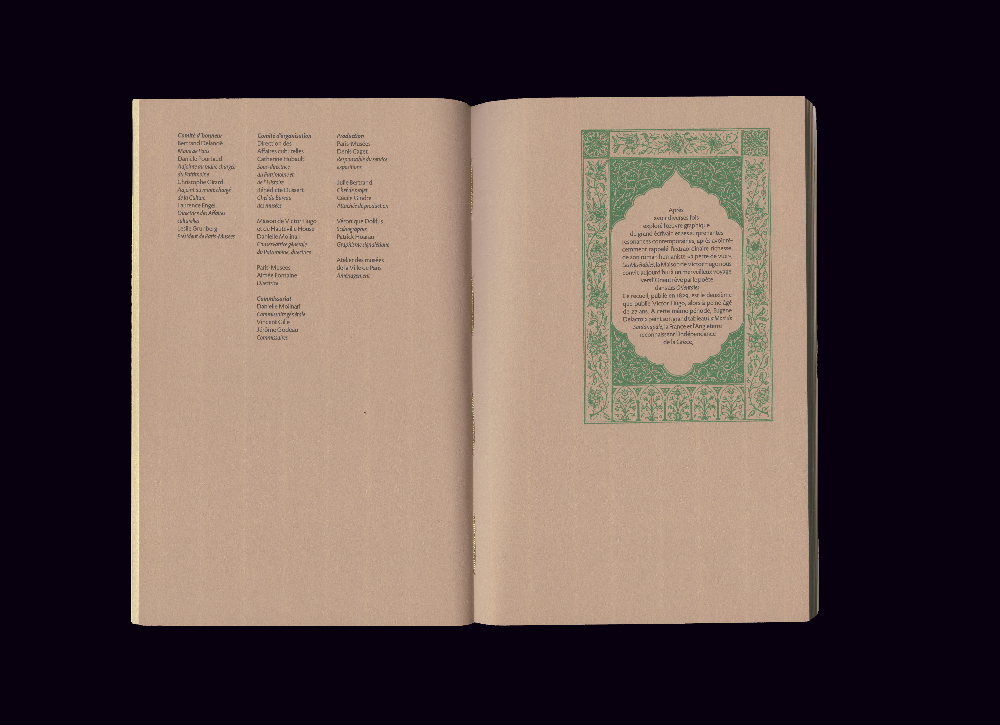

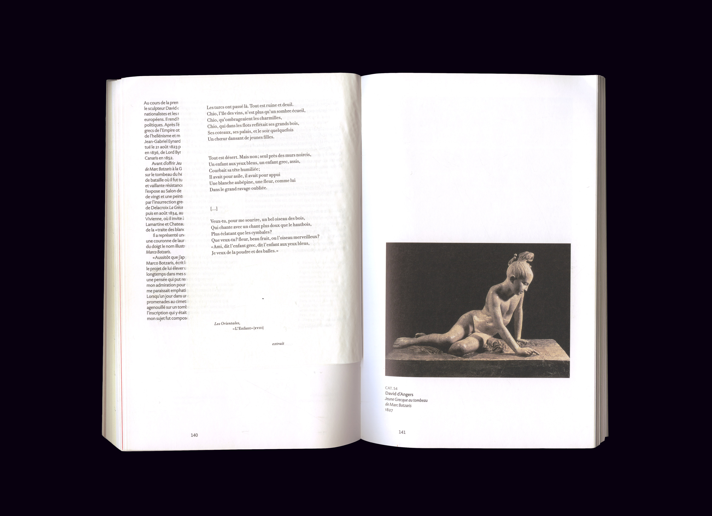

Thomas Golsenne, maître de conférence en histoire des images, s’emploie à nous mettre en garde contre *Les dangers du papier peint.* Il répond en partie à la question du décor et de l’ornement et des différences et similitudes qui les composent: «Le débat sur l’ornement souffre depuis le début du XXe siècle d’une infusion théorique et terminologique: on confond ornement et décoration. On a oublié que le terme de décor vient du latin decere qui signifie convenir […] le décor était une beauté convenable, approprié à son support, dans la mesure où elle le valorisait»<a href="#note2" id="retour2">2</a>. Néanmoins, l’ornement lui, était à l’origine une caractéristique formelle de chaque élément d’artefact, un artefact dépourvu de caractéristiques ornementales n’était en effet pas envisageable. «Dans le discours, la peinture, l’architecture ou la musique il devait y avoir plus ou moins d’ornementation selon les cas, les objets, les lieux.»<a href="#note3" id="retour3">3</a> 

	
La valeur identitaire de l’ornement devient une évidence (dans le sens où elle permet son identification). Indissociable de l’objet, il indique son appartenance à un mouvement, une époque, un lieu, une religion ou même à une classe sociale. Je cherche alors ce qui l’a fait disparaître de notre champ de vision. «D’un combat de trente années je suis sorti vainqueur, j’ai libéré l’humanité de l’ornement superflu.»<a href="#note4" id="retour4">4</a> Voilà ce que nous dit Adolf Loos dans la préface d’*Ornement et crime* en 1931. À la lumière de ce texte, j’entrevois des éléments de réponses. Se concentrant sur l’architecture viennoise, Loos déplore l’ornement superflu, imitation d’un style du passé, témoin visuel des arts appliqués, terme assassin de l’art et de l’artisanat selon lui. Les imitations médiocres, des voutes ornées des palais viennois, se retrouvant devant chaque demeure font naître en lui un sentiment de révolte contre cette population qui cherche la parure dans le but de tromper sur sa condition modeste. Ici il fait pour moi l’état d’une des valeurs de l’ornement qui le rapproche de telle ou telle catégorie sociale. Loos également défenseur de la modernité de son époque il ne renie pas l’ornement en réalité, il l’oppose à la productivité. Considéré comme une augmentation du temps de travail et non impliqué dans les qualités d’utilisations d’un objet, il le soustrait à la l’efficacité. Il tombe en désuétude lorsque son style passe, et que la «mode » décide par quelque mécanisme que tel ou tel motif floral doit être remplacé. Ainsi, il faut tout changer (encore) et nous voila pris dans un format consumériste de la société, qui gaspille temps et argent à la recherche d’un horizon insaisissable de son éternel mouvement.

L’impact qu’a eu ouvrage de Loos est aujourd’hui ré-évalué, et c’est cette ré-évaluation d’un siècle qui pour moi délimite les nouveaux enjeux de l’ornementation. De nos contemporains je retiens deux ouvrages, le premier de Rémi Labrusse publié l’année dernière: *Face au chaos, pensées de l’ornement à l’âge de l’industrie,* le second de Christine Buci-Glucksmann, *Philosophie de l’ornement d’Orient en Occident* publié en 2008. Que s’est-il passé donc depuis Loos et ce jusqu’à Labrusse?

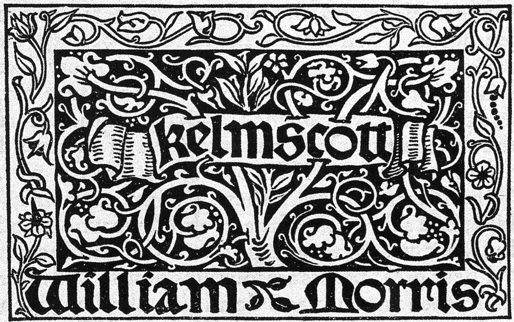	

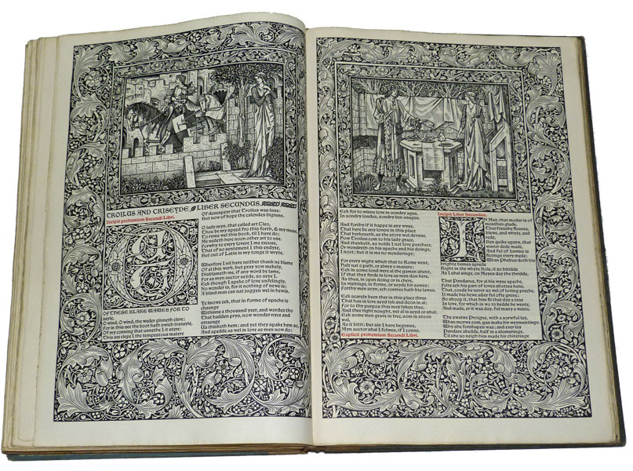

«L’histoire de nos refoulés, une histoire de la modernité et du modernisme, qui traverse les frontières établies entre le noble et le décoratif, le majeur et le mineur, le pur et l’impur, le masculin et le féminin, sans exclure autant ses autres géographies.»<a href="#note5" id="retour5">5</a> Cette valeur historique de l’ornement est introduite par Christine Buci-Glucksmann. L’ornement peut être aujourd’hui vécu comme une citation et son utilisation voulue comme une réminiscence du passé. L’ultra-modernisation que nous avons traversé, sous entend que nous oublions notre propre histoire, où tout s’épure débouchant sur post-modernité nostalgique. Toutes les sociétés ont cependant eut recours à l’ornement, avant de se tourner vers une homogénéité. On passe maintenant par une ré-évaluation de l’ornemental longtemps exclu et tabou en raison de ses affinités avec le féminin voué aux tissus, textures, tapis et autres travaux manuels. Alors, lorsque Loos affirme avoir libéré le mode de l’ornement, le monde lui pendant un siècle, cite l’ornement, le ré-emploi, le modifie, augmentant sa qualité d’art anonyme plus que d’art appliqué. À travers ces utilisations sur nos peaux, dans nos livres, sur les plafonds des nouveaux appartements parisiens, l’ornement reste, et évolue. Dans une exploration graphique de l’ornement, je retrouve ces réminiscences du passé, notamment dans l’espace du livre. À la lumière de ☜ *Kemlscott Press*, et des marges entièrement remplies et plantureusement détaillées en 1891, les illustrations sont autant de vecteurs d’informations sensibles que le texte, et ces deux éléments dialoguent au point de se rejoindre et de s’entremêler. Cette utilisation des marges aujourd’hui relève du passé, elle constitue cependant un héritage. Et lorsque que j’ouvre le livre ☟*Michel Butor*, au design efficace et simple de Spassky Fisher, je constate un lien. La couverture rigide, plus grande d’un centimètre et demi que le corps du livre dépasse de tous cotés, créant une marge, un cadre au livre. Un cadre coloré, fragmenté contenant des inscriptions et des informations. Cette simplicité, ne devrait donc pas concerner l’ornement et pourtant, dans sa participation à l’identité indéniable du livre elle transforme et cite à la fois l’ornementation classique remplissant les mêmes fonctions informatives sensibles. À la différence de William Morris, chez qui les marges sont chargées de gravures, chez Spassky Fisher elles sont des appuis visuels simples. Une des spécificités des pratiques ornementales contemporaines, réside dans la ré-invention de celles-ci. Le recul avec lequel on peut aborder aujourd’hui l’ornement, nous permet d’avoir une vision plus claire et plus libre en soi. La logique d’imitation qui à fait évoluer l’ornement ne se pratique plus telle quelle. Le simple mimétisme est remplacé par des réflexions plus analytiques des formes du passé. Ainsi, Michael Camille dans *Image dans les marges* s’emploie en 1997 à détailler l’usage de la marge depuis les manuscrits du Moyen-Âge. L’espace de la marge fonctionne comme une respiration, un espace blanc sur lequel s’appuie le texte ou encore qui permet un placement aisé des pouces lors de la prise en main du livre. Il n’a cependant pas toujours été vide. Les marges sont des lieux de composition en lien avec le texte. Elles sont des espaces de présentation, mais aussi d’information. Combien de graphistes les utilisent aujourd’hui pour y placer les notes, qui naviguent autour d’un texte central, créant des liens entre tous les éléments. Les notes, flottantes et ornant le texte visuellement et sémantiquement par leur apports de sens et de précisions sur celui-ci.

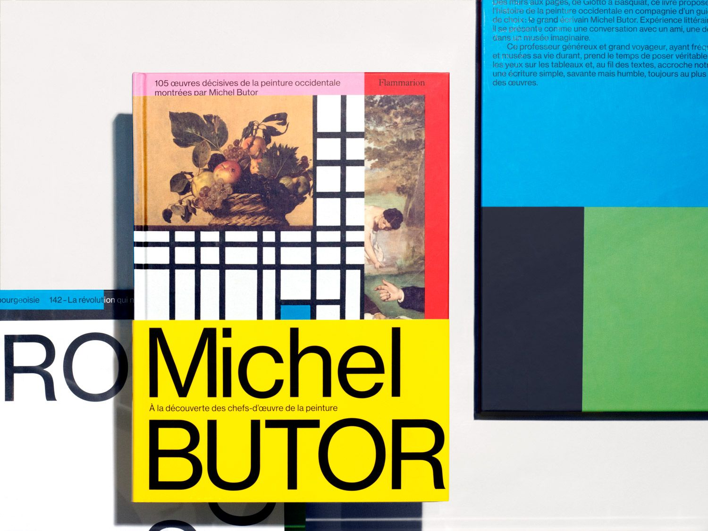

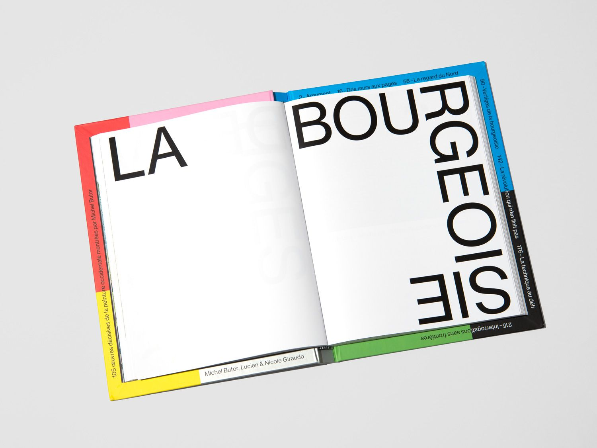

Le rapport de l’ornement à l’espace est en partie physique et il entretient un rapport cosmologique avec les civilisations. Dans son livre Rémi Labrusse introduit la connexion avec les concepts grecs d’organisation du monde. Le *cosmos* ordre et lumière, et le *parergon* l’obscurité et le chaos. L’ornement est un paradoxe né, impliquant l’ordre au même titre que son contraire dans sa conception première. Les arabesque répondent à une grammaire ordonnée au millimètre, mais il peut en résulter un brouillement visuel apparenté au surplus, à l’abondance incontrôlable. Il est cette ombre sur l’objet, ce voile dissimulant par la beauté, la simplicité. L’ornement subit cette accusation, en découle une sensation de vice et d’absurdité. Une division s’opère avec la conception de l’arabesque et de la ligne courbe comme étant les manifestations divines d’une pensée et d’une sensibilité impalpables. Le *cosmos* et le *parergon* s’affrontent, et de cette opposition naît de nouvelles formes. 

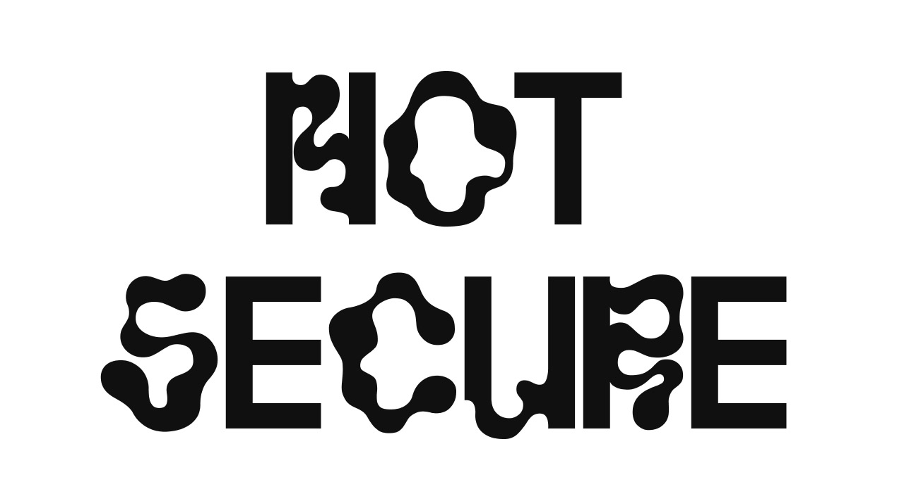

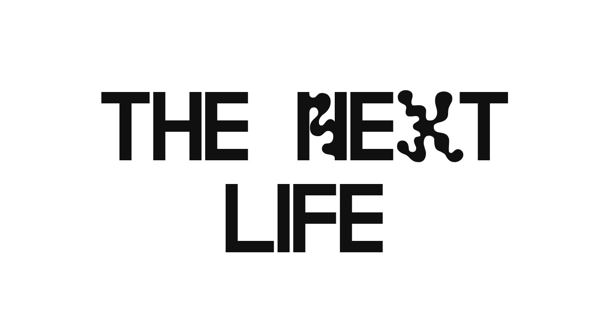

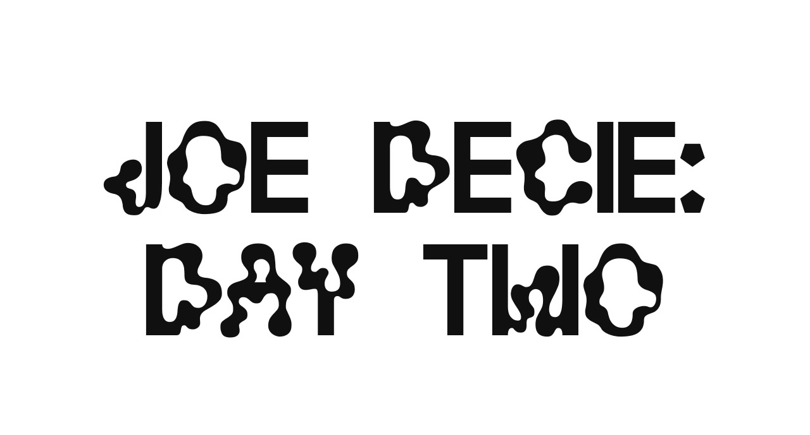

L’expression, au sein d’un même univers, de l’ordre et du chaos, cela me ramène à un caractère typographique dessiné par Karl Nawrot et Radim Peško dans lequel on peu retrouver certaines caractéristiques de ce contraste. Entre 2009 et 2012, ils ont travaillé sur ☜ le projet Lÿno, une famille typographique comprenant quatre membres: Ulys(ses 31), Stan(ley Kubrick), Jean (Arp) et Walt (Disney). Sur ces quatre membres, je choisis l’exemple Jean (Arp). Cette typographie, en hommage au travail du peintre et sculpteur Jan Arp, est structurée par une base linéale modulaire. Cependant, les parties normalement «courbes» et les diagonales sont transformés en formes organiques aux lignes souples inspirées directement du travail formel de l’artiste. Je ne doute pas de la bizarrerie provoquée par l’agencement inattendu de ces formes cependant j’entrevois aussi leurs rapport à l’ornement. S’employer à orner une typographie basiquement opposée aux qualité ornementales c’est quelque part faire état d’une modernité. Cette typographie relève simultanément d’une transformation de l’originale, et d’une création ornementale. Il y a dans cet exemple, une réminiscence de la création humaine déjà développée dans les premiers écrits sur l’ornement de Karl Philip Moritz en 1793:  «L’esprit humain est toujours actif, il ne peut souffrir les masses mortes et uniformes, il cherche à leur insuffler la vie, il crée et forme à partir de lui-même.»<a href="#note6" id="retour6">6</a> Il y avait dans ces mots cette évocation de la création humaine complexe, opposé à la simplicité forcée. Les formes ornementales, ne sont pour lui que des formes libres, en cela crées par l’homme elle n’imitent rien et ne signifient rien. C’est la liberté créatrice exprimée au maximum par la forme et la couleur, induite par l’imagination pure et non exposée aux controverses et complications de la présentation du monde.

Son statut complexe et sa présence dans nos environnements projète sur l’objet orné une subjectivité opposé à l’objectivité matérielle. Se détachant de la fonction première et physique de l’objet, l’ornement se traduit comme une manifestation visible de la relation objet/humain. Considérons un objet graphique comme transmetteur d’informations, la relation de l’Homme à cet objet réside immanquablement soit dans sa création, soit dans la réception de l’information. Cette information peut être selon moi divisée en deux catégories, celle qui est concrète (lisibilité du texte, compréhension de celui-ci etc.) et celle qui est intrinsèque. Peut être est-il possible de l’apparenter à l’ambiance d’un objet, ce qu’il dégage par ses formes, mais je ne pense pas que cela serait suffisant pour apporter une explication. Une forme de décodage de l’information à deux niveaux, de la perception de celle-ci sur deux plans.Tu trouveras des choses à la fois dans la phénoménologie comme chez Merleau-Ponty Il y a, à mon sens, dans chaque objet graphique, une âme si on peut dire, mais une forme impalpable de communication. «Il y a dans la chair de la contingence une structure de l’événement, une vertu propre du scénario qui n’empêche pas la pluralité des interprétations.» c’est ce que nous dit Merleau Ponty dans *l’Œil et l’esprit*. Un objet physique dont l’image traverse chaque oeil se retrouve interprété singulièrement par chacun. Cette forme impalpable de communication peut éventuellement être apparentée à la notion de style. «Mais le style est alors, par-dessus tout, un sytème de formes qui possèdent une qualité et une expression significative rendant visibles la personnalité d’un artiste et la conception générale d’une collectivité»<a href="#note7" id="retour7">7</a>. Dans cette première partie de *Style artiste et société,* Meyer Schapiro nous présente cette notion et ses définitions de différents points de vues: l’archéologue, l’historien de l’art, celui qui fait une histoire synthétique de la culture, le critique et l’artiste. J’ai en mémoire un exemple, le travail de ☟ Félicité Landrivon. Je croise fréquemment dans les rues de la presqu’île lyonnaise ses différentes affiches réalisées à un rythme effréné pour le *Grrrnd Zero,* un espace de la fête underground. On peut en saisir l’atmosphère par un simple regard. L’information concrète pour chaque évènement est présente, et présente au même niveau que tout le reste. La couleur la composition sont mélangées aux images, sous des typographies ornementales, sur des papiers colorés, tout cela dans un équilibre manifestant pour moi un tour de force dans la compréhension d’une information à deux niveaux. En effet son style devenu l’identité du lieu, passant non pas par un logo ou des marqueurs graphiques dentaires classique (une typographie, une couleur, un agencement reconnaissable) mais un traitement spécifique de l’information. Je retrouve ici l’ornement identitaire, seulement il n’est pas une forme ajoutée, mais justement un *style*. Il s’épanouit par les multitudes d’emplois différents de formes, d’images et de couleurs. Mais aussi, par un éloignement des formes classiques ornementales, et il reste cependant toujours présent. L’ornement, depuis ses premières apparitions religieuses, s’est aussi manifesté comme un marqueur social, il l’est toujours, seulement il est devenu également underground. Ses affiches présentent chaque évènement avec une certaine singularité, et la composition, les couleurs disent: surtout venez comme vous voulez, avec qui vous voulez, pour les raisons que vous voulez. Il y dans ce travail une cohésion vernaculaire entre ce qui est dit et ce qui est suggéré.

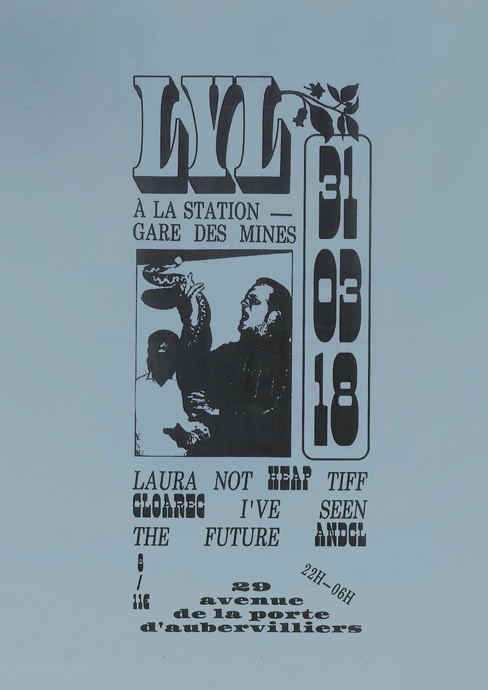

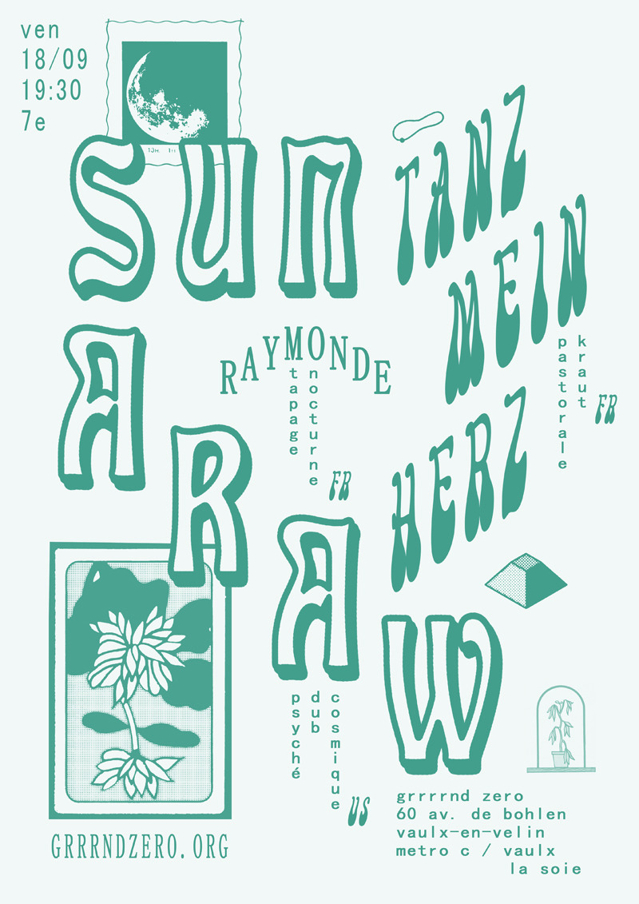

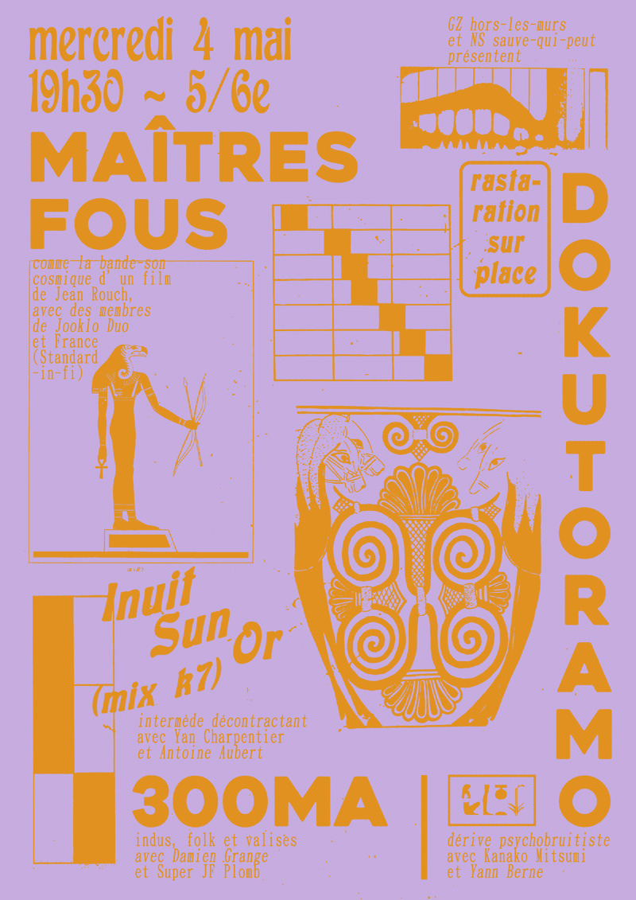

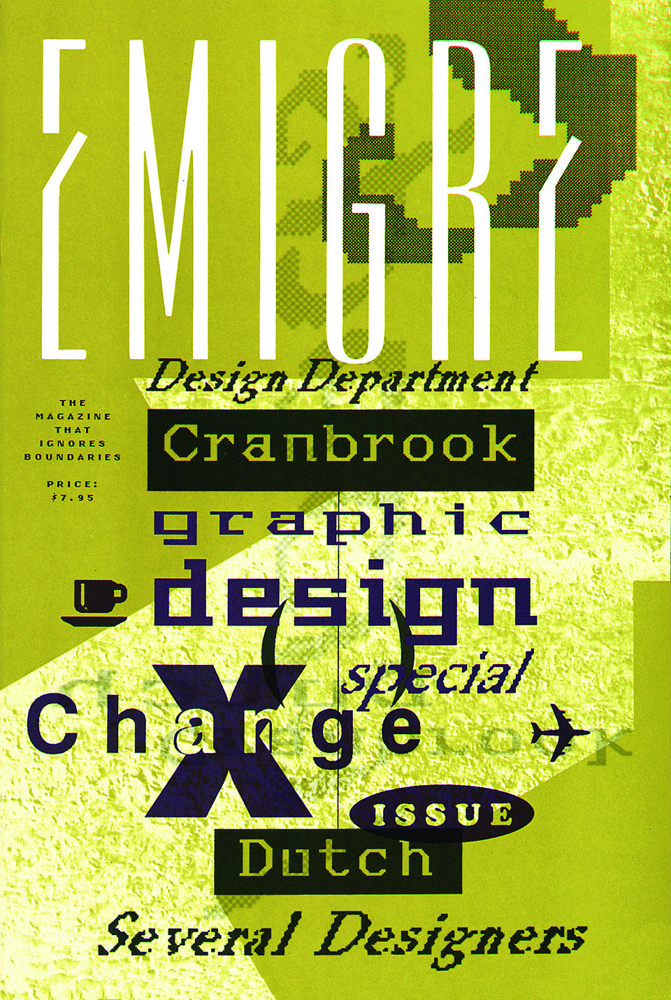

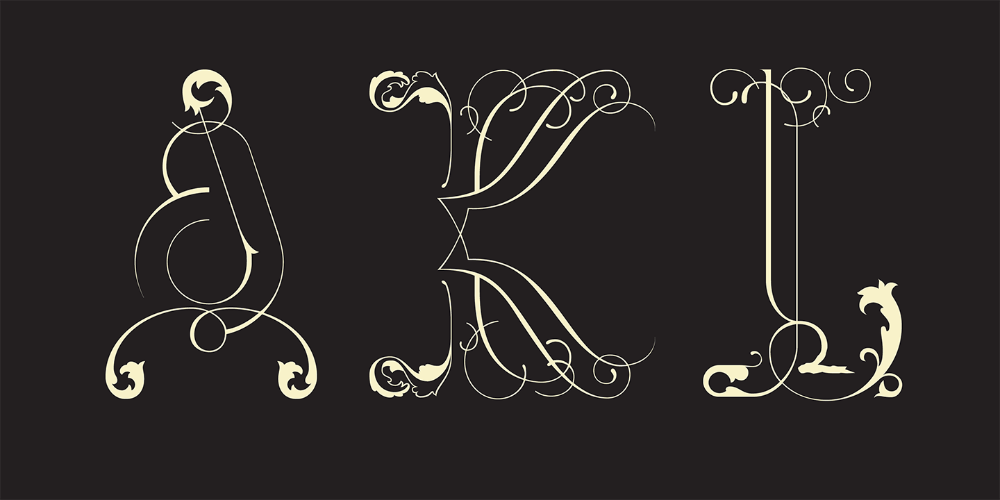

L’ornement est une manifestation de la pensée, et de ce qu’elle veut exprimer en sensations et réflexions en lien avec une époque. Dans la période de digitalisation des données et notre pensée, l’ornement a suivi ces évolutions. Si l’on regarde ce qu’a produit ☟ *Emigre* ou ☟ *The Designers Republic*, on peut tracer un lien avec l’ornement. C’est dans cette digitalisation du graphisme, que s’est accéléré l’évolution ornementale. Les formes ont été transformées, car les techniques ont changé. À la fois dans une adaptation de celles-ci à l’affichage pixel et dans la création de nouvelles. Et cette accélération va de paire avec l’accélération de la production. Il y a un lien de l’ornement à la machine que soulève Labrusse, celui de la subjectivité: «Mais la pensée de l’ornement conduit plus en profondeur: ce qu’elle à très vite atteint, et avec une intensité qui souvent, à inquiété ceux qui s’y vouaient, c’est la question de la place de la subjectivité dans un monde ou la forme vient toujours davantage de la marche des machines»<a href="#note8" id="retour8">8</a>. Par exemple, certaines fontes se sont vues digitalisées avec leurs ornements, destinés, en plomb, à la composition du livre. Je parle des manicules, des feuilles de vignes, ces éléments on été intégrés dans les glyphes des typographies sans pour autant être indispensables. Néanmoins ces petits glyphes se baladent toujours dans nos ordinateurs, et sont une première réponse aux manifestations ornementales modernes. Une invocation du passé, une citation ou un respect des normes. Néanmoins, émergent immanquablement de nouvelles techniques et donc de nouvelles formes, un nouveau courant. Et c’est le deuxième élément de réponse que je pourrais apporter, ces manifestions ornementales, sont indissociables de la technique. Et si, il y a plus de vingt ans, la technique et l’empreinte digitale transparaissent à travers les travaux graphiques, l’ornement est toujours un symptôme et se manifeste encore selon notre immatérialité contemporaine. Où plutôt il tend à s’affranchir des formes connues, pour aller vers une dématérialisation caractéristique indéniable de notre société. 

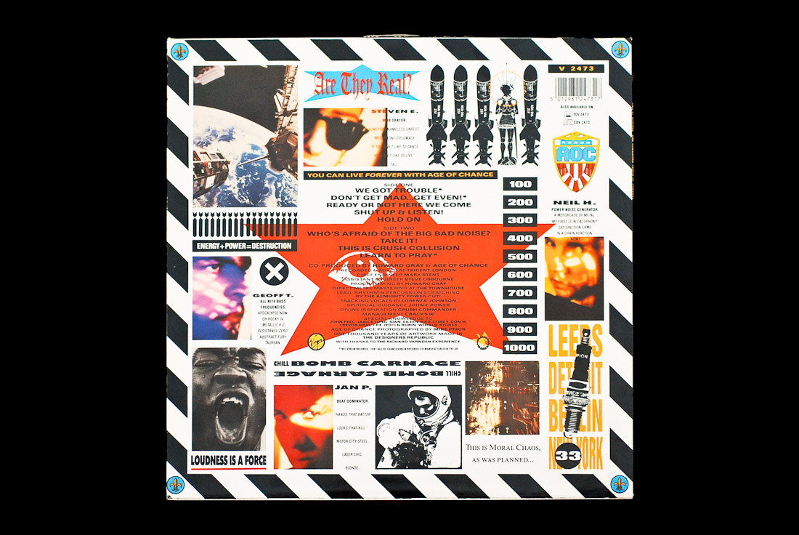

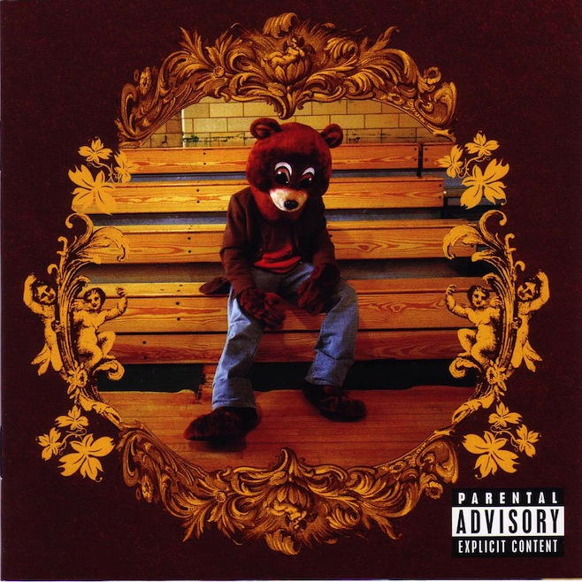

En effet si l’on ne se soucie plus de ce qu’il indique vraiment comme marqueur social, puisque les points de références et ses utilisations ont été mélangés. Dans le détournement de certains signes, la vulgarisation des motifs et leurs utilisations décontextualisées. L’album ☟ *College Dropout* de Kanye West, emploi par exemple un cadre similaire à ceux des miroirs orné de moulures dorées du XIXe siècle. Détourné de leur contexte, ces moulures, signent l’album visuellement sans l’apparenter à la bourgeoisie. La circulation a la vitesse de la lumière (littéralement) de l’image et de l’information implique aujourd’hui que chaque élément peut être potentiellement repris a travers le monde dans différents supports, dans différentes cultures. Mais ce détournement était déjà à l’origine d’*Ornement et crime* nous l’avons vu avec les ornement architecturaux viennois. Aujourd’hui nous nous dirigeons vers des formes inconnues, impalpables car presque invisibles .À la recherche d’identifications qui ne se manifestent plus comme des fleurs courant dans les marges, mais par d’autres choix graphiques. Le papier peut en être lorsqu’on y prête attention peut interroger la pratique ornementale. Dans son grammage, sa texture, sa main. Ces éléments constituent le prisme a travers lequel les choix son effectués. Bien sûr les facteurs techniques et économiques de la fabrication d’un ouvrage y participe, mais la part mince de choix resté libre enrichi l’objet, agissant comme une gravure identitaire et ornementale. Il peut aussi se manifester par d’autres choix comme l’augmentation d’un ouvrage. Les pages liminaires aux trames colorées de Frédéric Teschner dans le ☟ Catalogue de Chaumont en 2010 retiennent aussi mon attention. Elles se déploient sur quelques pages, l’identification du livre se fait progressivement en explorant les points des trames. Dans les choix de reliures se manifeste également des formes alternatives d’ornementations, par le fil choisit, ou dans l’utilisation de matériaux inhabituels. Je n’en fait pas ici la liste exhaustive, mais j’ai la volonté d’en signifier certaines et ces manifestations ornementales, immatérielles contribuent selon moi à une explication de sa non disparition, mais de sa transformation certaine.

<a href="#retour1" id="note1"> 1 </a>		Victor Hugo, Les sultanes,  extrait du poème «La Sultane favorite» (*Les Orientales, XII*). 	
<a href="#retour2" id="note2"> 2 </a>		Thomas Golsenne, *Ever Living—Ornement*, Paris, B42, 2019. p. 74. 
<a href="#retour3" id="note3"> 3 </a>		*Ibid.* 
<a href="#retour4" id="note4"> 4 </a>		Adolf Loos, *Ornement et Crime*, Paris, Rivages, 2015, «Rivages Poche». p. 21. 
<a href="#retour5" id="note5"> 5 </a>		Christine Buci-Glucksmann, *Philosophie de l’ornement*, Paris, Galilée, 2008, p. 15. 
<a href="#retour6" id="note6"> 6 </a>		Karl Philip Moritz, *Sur l’ornement*, Paris, Édition Rue d’Ulm/Presses de l’École normale supérieure musée du quai Branly, 2008, p. 29. 
<a href="#retour7" id="note7"> 7 </a>		Merleau-Ponty, *L’Œil et l’esprit*, Paris, Gallimard, 1964,  «Folio plus philosophie», p. 16. 
<a href="#retour8" id="note8"> 8 </a>		Rémi Labrusse, *Face au chaos. Pensée de l’ornement à l’âge de l’industrie*, Paris, Presses du réel, 2018, p. 7. 

BIBLIOGRAPHIE

BONNEFOY, Yves, *Poésie et photographie,* Paris, Galilée, 2014, «Lignes fictives».

BUCI-GLUCKSMANN, Christine, *Philosophie de l’ornement, d’Orient en Occident,* Paris, Galilée, 2008.

CAMILLE, Michael, *Images dans les marges,* Paris, Gallimard, 1997, «Le temps des images».

DIDI-HUBERMAN, Georges, *Ce que nous voyons, ce qui nous regarde,* Paris, Les éditions de minuit, 1992, « Critique ». 

GILLOW, Norah, *William Morris: Ornements et motifs,* Paris, Bookking Int., 1988, «Encyclopédie des arts décoratifs».

GOLSENNE, Thomas, *Politique de l’ornement, les implications politiques de l’ornement,* 2017, (page consultée le 30 janvier 2019) texte: <a href="https://motifs.hypotheses.org/531">ici</a>

GOLSENNE, Thomas, *L’ornement Aujourd’hui,* 2012 (page consultée le 30 janvier 2019) texte: <a href="https://journals.openedition.org/imagesrevues/2416">ici</a>

KAENEL, Philippe, *Les périodiques illustrés 1890-1940,* Paris, Infolio, 2011.

KELLY, Rob Roy, *American Woodtype, 1828-1900, notes on the evolution of decorated and large types,* Saratoga, Liber Apertus Press, 2016.

LABRUSSE, Rémi, *Face au chaos: Pensées de l’ornement à l’âge de l’industrie,* Paris, Presses du réel, 2018.

LOOS, Adolf, *Ornement et crime,* traduit de l’allemand (Autriche) par Sabine Camille et Philippe Ivernel, Paris, Rivages, 2015, « Rivages Poche ».

MCLEAN, Ruari, *Typographers on Type,* Londres, W. W. Norton & Company, 1995.

MERLEAU-PONTY Maurice, *L’Œil et l’Esprit,* Paris, Gallimard, 1964,  «Folio plus philosophie».

MORITZ, Karl Philippe, *Sur l’ornement,* Paris, Édition Rue d’Ulm/Presses de l’École normale supérieure-musée du quai Branly, 2008, « Æsthetica ».

PEIGNOT, Jérôme, *Petit traité de la vignette. Elle contribue à l’ivresse de la lecture,* Paris, Imprimerie nationale éditions, 2000.

SCHAPIRO, Meyer, *Style, artiste et société,* traduit de l’anglais (américain) par Blaise Allan, Daniel Arasse, Guy Durand, Louis Évrard, Vincent de la Soudière et Jean-Claude Lebensztejn, Paris, Gallimard, 1982, « Tel ».

SHERMAN, Nick, *The design of Type Specimens; or, Decorative Compositions Need Thorough Attention.*,The Shelf, Publishing design, cult of the shelf, 2012, n°1, p. 34—41.

s.n. Catalogue des plus beaux livres suisses, The past issue. s.n., 2008.

[Exposition: Ever living—Ornement.] *Ever living ornement,* Dir Sophie Auger et Valérie Knockel, Paris, B42, 2012.

RENNERT, Jac et WEILL Alain, *Alphonse Mucha, toutes les affiches et panneaux,* Paris, Henri Veyrier, 1984.

VANDERLANS, Rudy. *Emigre No.70 the Look Back Issue, Selections from Emigre Magazine 1—69. Celebrating 25 Years of Graphic Design,*  Berkeley, Gingkopress, 2009.

